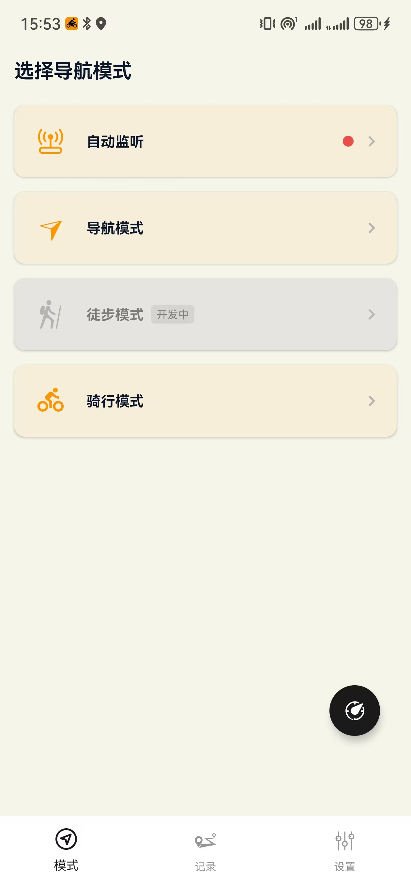
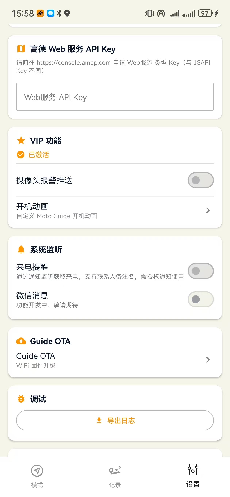
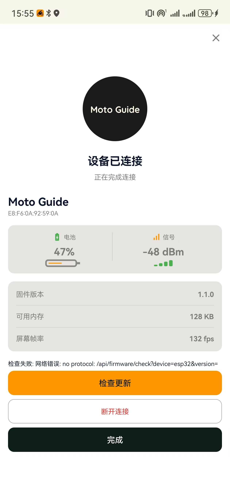
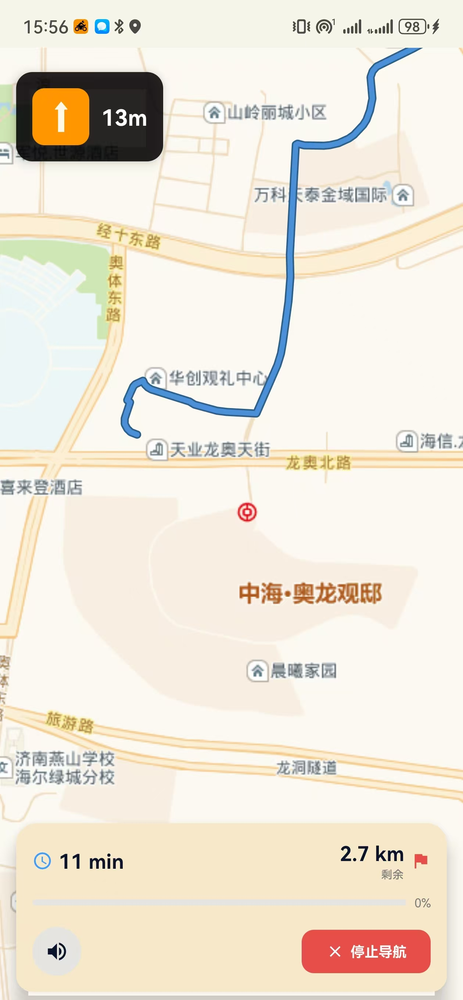
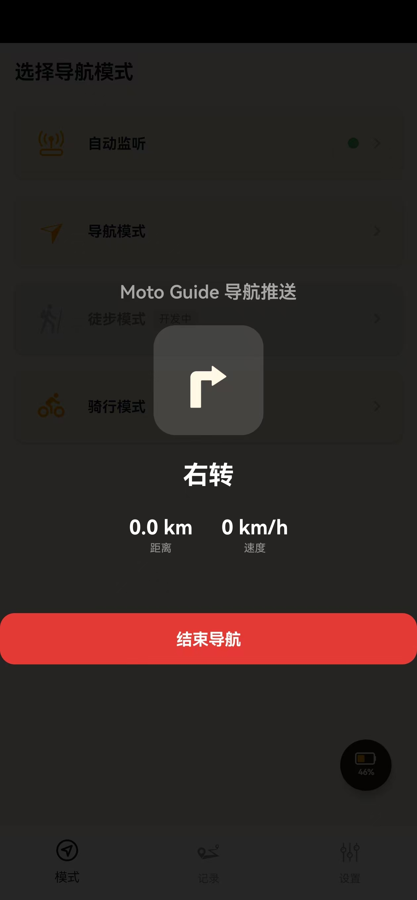
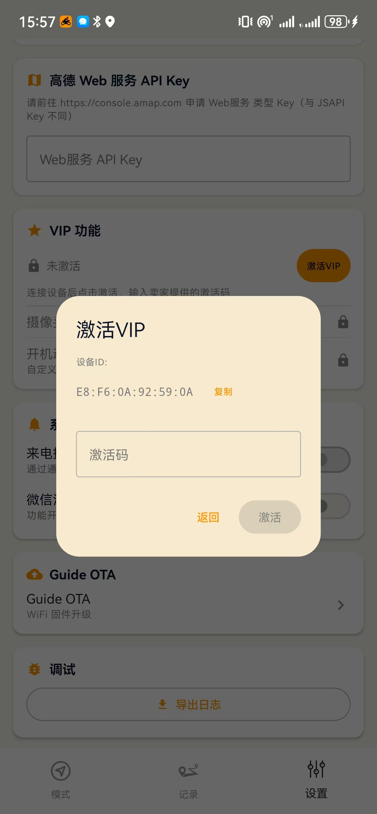
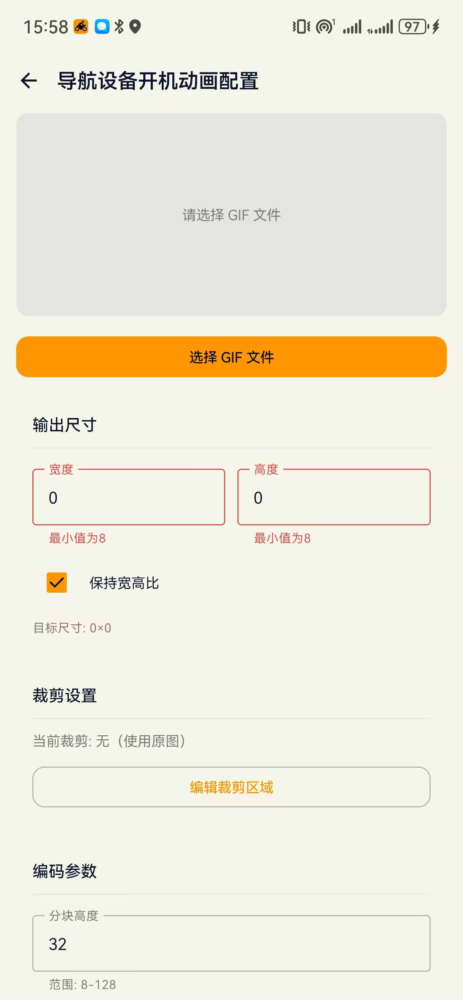
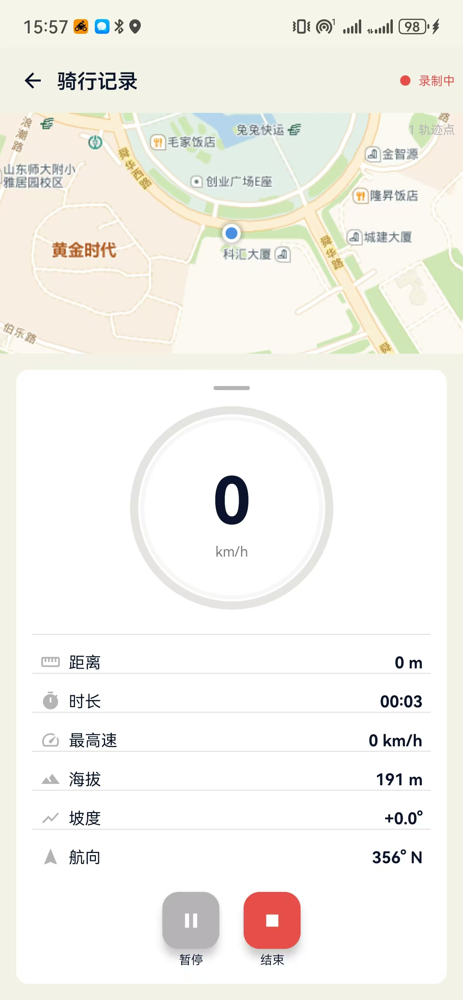

# Solo-Guide

> 一款与 ESP32 设备通过 BLE 蓝牙连接的摩托车导航推送 App —— 把导航路线，实时推送到车把上的圆形仪表盘。

---

## 📋 目录

- [系统要求](#系统要求)
- [安装方式](#安装方式)
- [快速开始](#快速开始)
- [功能介绍](#功能介绍)
  - [设备连接](#设备连接)
  - [监听模式](#监听模式)
  - [导航模式（备用）](#导航模式备用)
  - [骑行模式](#骑行模式)
  - [WiFi OTA 固件升级](#wifi-ota-固件升级)
  - [VIP 增值功能](#vip-增值功能)
  - [日志导出](#日志导出)
- [界面截图](#界面截图)
- [反馈与支持](#反馈与支持)

---

## 系统要求

| 项目 | 要求 |
|------|------|
| 手机系统 | Android 8.0 及以上 |
| 蓝牙 | BLE 4.2 及以上 |
| 地图 App | 高德地图 / 百度地图（腾讯地图适配中） |
| 硬件设备 | ESP32-S3 导航屏幕（需预先烧录固件） |

> ⚠️ **注意**：使用前需要先给 ESP32 设备烧录配套固件。

---

## 安装方式

### 直接下载 APK（推荐）

> 下载链接：[GitHub Releases](https://github.com/MotoGuide/Solo-Guide/releases/)

下载 APK 文件到手机，直接安装即可。首次安装需允许"安装未知来源应用"。

---

## 快速开始

**第一步：连接设备**
1. 打开 App，进入「设置」Tab
2. 点击「扫描设备」，在列表中选择你的 ESP32 设备
3. 连接成功后，顶部状态栏会显示电量和固件版本

**第二步：开始导航**
1. 确保 ESP32 设备已连接（App 会自动开启监听服务）
2. 打开高德地图或百度地图，搜索目的地并选择路线
3. 点击「分享」→ 选择「MotoNav Bridge」
4. App 自动解析路线并推送到屏幕，无需其他操作

**第三步：路上看屏**
- 屏幕实时显示：方向箭头、剩余距离、当前速度、路线进度
- 接近抓拍摄像头时自动语音提醒（需开通 VIP）
- 到达终点自动结束，行程自动保存

---

## 功能介绍

### 设备连接

通过 BLE 蓝牙连接 ESP32 导航屏幕，连接后自动维持。支持查看设备信息（电量、固件版本、信号强度）、断开/重连、历史设备快捷连接。

### 监听模式

**默认推荐模式**，零配置开箱即用。

ESP32 连接后自动开启监听服务。在高德地图或百度地图中，将导航行程**分享**至本 App，即可自动解析路线并推送至屏幕。

- 如果不偏航，分享成功后即可退出地图 App，省电省流量
- 如果行驶途中可能偏航，请保留地图 App 后台运行以获取重算路线

### 导航模式（备用）

App 内置地图引擎，支持搜索地点、规划路线、独立导航。需要先在「设置」中配置高德 Web API Key（免费申请）。

此模式为监听模式的**备用方案**——日常使用监听模式即可，当监听模式因地图 App 更新等原因暂时失效时，可切换至此模式应急。

> 💡 高德 Web API Key 申请方式：前往 [高德开放平台](https://lbs.amap.com/) 注册 → 创建应用 → 获取 Key → 填入 App 设置页。

### 骑行模式

基础骑行记录功能，类似自行车码表。记录 GPS 轨迹、速度、里程等数据。当前数据通道已打通，码表仪表盘等深度功能将持续迭代。

### WiFi OTA 固件升级

无需数据线，通过 WiFi 无线升级 ESP32 设备固件：
1. 在 ESP32 设备上开启 WiFi AP 模式
2. 在 App 中进入「WiFi OTA」页面，连接设备热点
3. 选择 `.bin` 固件文件，点击升级

### VIP 增值功能

VIP 功能为可选增值服务，**核心导航功能完全免费**。通过激活码开通后可享受：

- **开机动画配置**：导入 GIF 动图，自定义 ESP32 设备的开机画面
- **抓拍摄像头报警**：导航过程中，前方有摩托车抓拍摄像头时自动语音提醒。支持 13 种抓拍类型（闯红灯、超速、违规变道、不戴头盔等）

### 来电通知

打开此功能需要授权获取系统通知，骑行过程中可推送来电信息至 ESP32 设备，有备注的显示备注，没有备注的显示电话号码。

### 日志导出

使用中遇到问题时，可通过「设置 → 导出日志」获取日志文件。将日志文件、Bug 描述、截图一并发送给开发者，协助排查修复。

---

## 界面截图

### 首页

### 设置页

### 设备信息页

### WiFi OTA 页

### 导航模式页

### 监听模式页

### VIP 激活页

### 开机动画配置页

### 骑行模式页

---

## 反馈与支持

- 📧 **邮箱**：chengzidada123@gmail.com
- 🐛 **Bug 反馈**：请附带「日志文件 + 问题描述 + 截图/照片」，开发者会在下个版本修复
- 💡 **功能建议**：欢迎邮件沟通

---

*Made with ❤️ for riders.*
