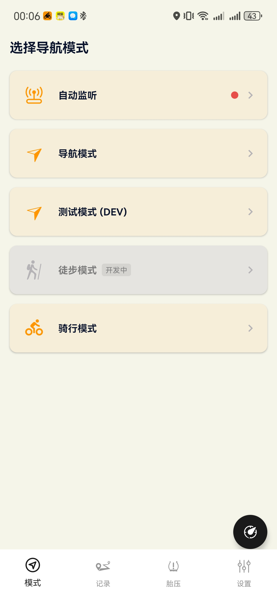
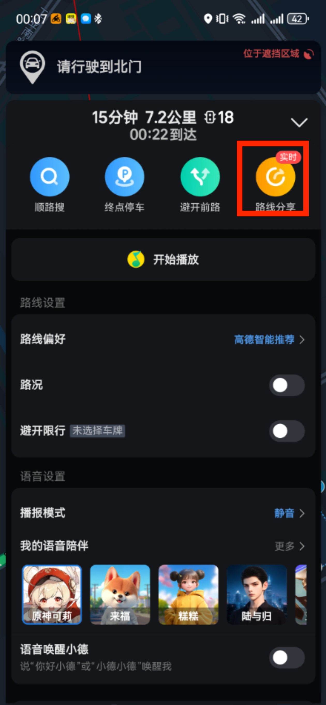
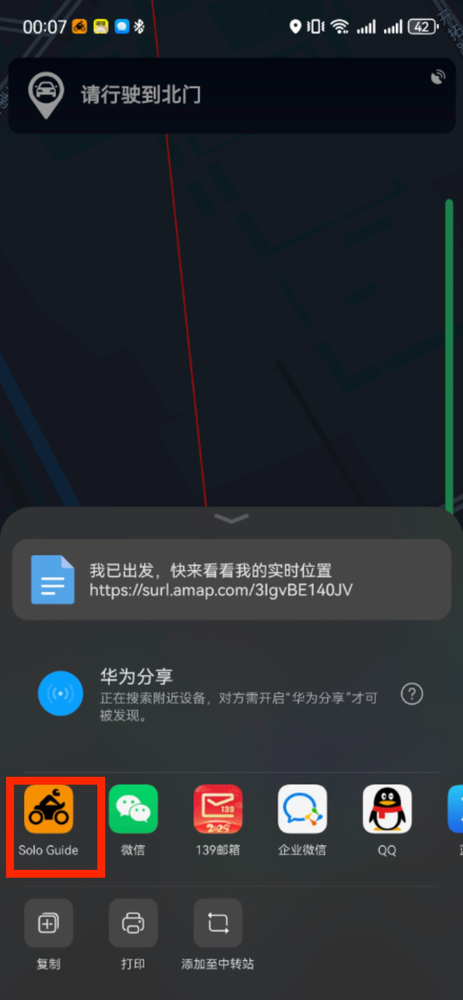
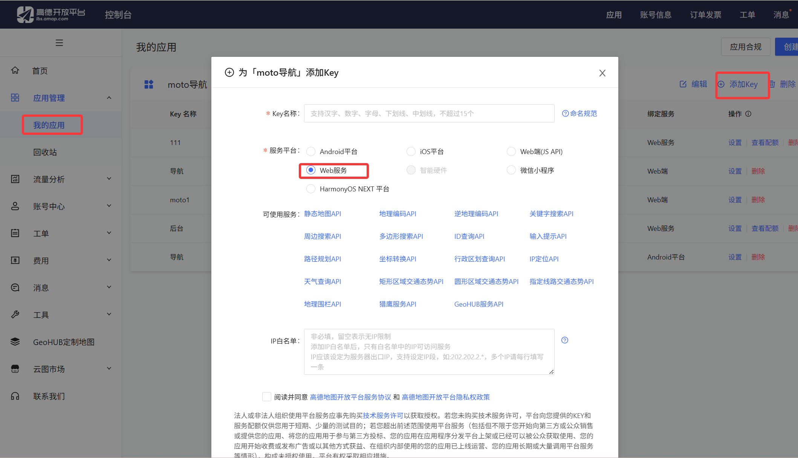
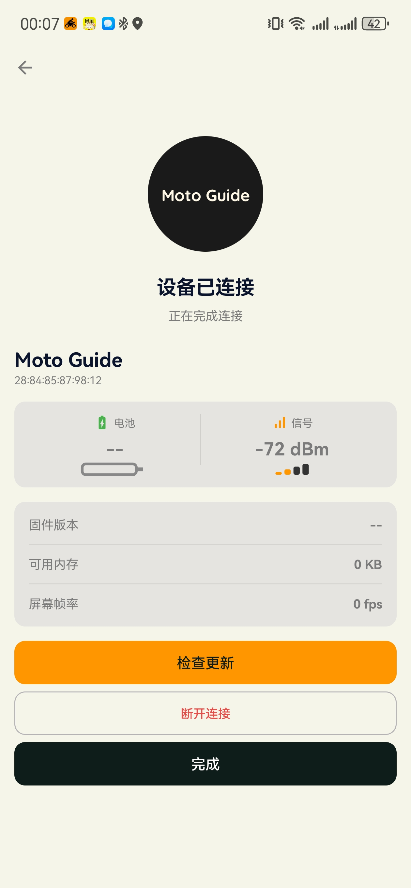

声明：本软件仅供个人学习研究使用，请勿四处传播或分享他人，因使用过程中出现的任何法律问题与作者无关。

1、设备开关机

1.43小屏幕版本：到货请先充电，充十分钟再开机，开机方式为type-c口左边下方按键，按住不放看到亮屏松开即可。（注意：1.43由于没有电源管理模块，开机可能存在极端电量低的情况下造成屏幕锁死现象，目前已在开机代码里加上了低电量拒绝开机的代码，是否修复未知？）
1.85大屏幕cnc版本：左下角按键为开关机，点击为开机，开机状态下按住不放则关机，右下角按键为切换屏幕

2、app激活

安装app后，给予相应的权限，点击扫描连接上设备之后，输入群公告的地址，点击激活则成功，激活为一次性激活，不卸载的话激活状态持久化。（如扫描不到设备，请去系统蓝牙列表里看搜没搜到，如果搜到了，则联系卖家，忘了发布新的apk了，因为app里有设备过滤）

3、导航的使用

导航分两种模式，自动监听模式和导航模式。
3.1自动监听模式
设备连接后自动开启，自动监听模式后面绿灯，设备断开则红灯。

在高德、百度、腾讯app选择路线开启导航后，点击分享路线，分享到这个app上，则获取路线成功，自动开机导航推送至设备。（注意，一定是开启导航之后，不是路线规划页面）

如果想有偏航重算的效果，则保持原导航app不要退出，如果路线中不偏航，则可以清掉原app的后台。
导航语音播报可以由原app进行播报，不影响。
3.2导航模式
导航模式为备份，需自行申请高德web api key填写，自动监听模式失效后，可以使用此模式进行导航，个人的key有免费额度足够使用，导航模式支持驾车、骑行、电动车、步行四种导航，摩托车可以用骑行或者电动车替代。

3.3 步行模型、骑行模式
不稳定，暂时不要使用

4 设备连接
请使用模式页面右下角的按钮进行扫描连接
连接成功后设备端会显示手机符号，app端会显示设备详情

设备详情会显示对应的信息，每10s更新一次

5、轨迹详情页
目前功能不稳定
点击某条轨迹，可以显示该路线的详细信息
压弯数据暂时用gps+路线进行计算，与实际不符，当个乐子看就行了

6、胎压页面

需配套的胎压监测设备，目前仅适配了一台，需要可以联系获取型号

此功能正在持续开发，目前已经实现扫描和设备推送显示，1.43暂未跟进

此功能需后台持续进行蓝牙扫描，略微耗电，不需要可以关闭，需要的时候开启

7、设置页面
从上往下依次
深色模式，白天黑夜还是自动
语言切换；英文不全，不需要点击

高德webkey，可以在这里填写，也可以去导航模式页填写

vip功能
vip功能目前只有两个，一个是更换设备的开机动画，一个是摩托车导航摄像头报警，需激活码激活

系统监听
可以监听来电信息，骑行过程中把来电信息推送至设备显示，不需要掏手机就知道谁打电话
微信做了，感觉消息太乱了，就注释掉了

定位服务
没有谷歌三件套的千万不要开启，尤其是国行三星（会获取不到定位！！！！）

系统权限
由于app需要后台持续运行与蓝牙数据推送，国产rom杀后台太严重了，请把该给的权限都给了，放心，这个app没有任何后门，也不是很吃性能占内存

ota功能
设备的固件更新从这里，手动下载固件到手机后，用这个功能扫描设备二维码，更新固件

关于
版本更新说明
